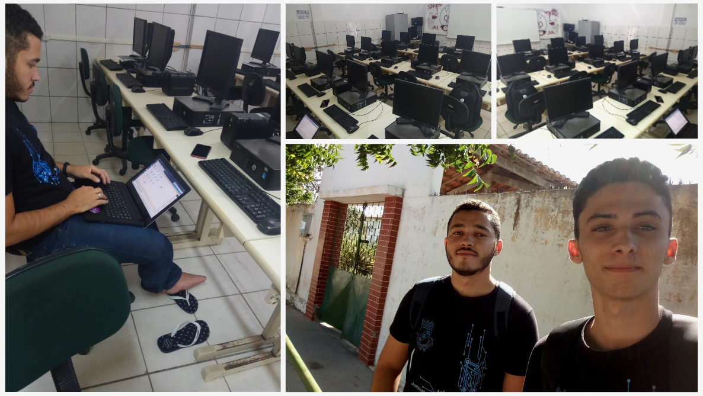

# Gerencia de Redes de Computadores
## Universidade Federal do Ceará - Campus Quixadá

## Monitorização do laboratório de informática da Escola de Ensino Médio Professora Maria Edilce Dias Fernandes - Ibicuitinga


Antonio Matheus Cavalcante da Silva <br>
Esdras Emanuel Mariano Moreira

## Objetivo
Fazer o Gerenciamento de um laboratório de informática utilizando a ferramenta de monitorização ZABBIX. Este trabalho, monitorou 13 hosts do laboratório escolar de informática da escola Maria Edilce Dias Fernandes, foi desenvolvido um script de desligamento automático das máquinas no fim do horário letivo, facilitando assim, o trabalho do gerente e também poupando recursos. #foratemer

## Cenário

#### Topologia:
13 computadores funcionando

<div align="center"></div>
<div align="center"></div>

#### Sistema:
Ubuntu 16.04 

#### Funcionamento do laboratório: 
07h às 11h e de 13h às 17h

## Ferramenta
```
ZABBIX - Versão 3.2.11
```
## Servidor


## Instalação dos Agentes
**pré-requisitos**
- sshpass

Foi feito um script para a instalação automatizada do agent zabbix em todos os hosts do laboratório. O script ultiliza conexão via SSH para entrar em cada máquina, executar os comandos e adicionar as configurações no arquivo zabbiz_agentd.conf, em seguida ele pinga em todos os IPs de uma determinada rede que é colocada como parâmetro no momento da execução, e os hosts que foram pingados receberam uma tentativa de acesso via ssh para executar os comandos de instalação e configuração. <br>
**Modo de executar:**
```
./install_agents.sh subrede. usuario senha
./install_agents.sh 20.20.1. aluno aluno
```

## Configuração do ambiente no Zabbix

Foi criado um grupo chamado LEI (Laboratório Escolar de Informática) para adicionar os hosts no mesmo.
<div align="center"></div>

Em cada host, adicionamos o template ( Template OS Linux )
<div align="center"></div>

Todos os Hosts Adicionados 
<div align="center"></div>

## trigger
Criamos a trigger para o Template OS Linux, logo todos os hosts a herdaram.
<div align="center"></div>

**Código**
```
{Template OS Linux:agent.ping.time()}>110000 and {Template OS Linux:agent.ping.time()}<130000 or {Template OS Linux:agent.ping.time()}>170000 and {Template OS Linux:agent.ping.time()}<180000
```
## Acão
Depois, criamos a ação a ser tomada quando a trigger disparar.
<div align="center"></div>

## Operações
Em operação, definimos o tipo da operação para comando remoto, a lista de destino para o host atual, executar no Agente Zabbix e o comando para o desligamento da máquina.
<div align="center"></div>

```
sudo shutdown -h 1 "Fim do horário letivo, desligando em 1 minuto."
```
 A ação será executada quando a trigger que foi configurada, "deligamento" for verdade.
 
 No momento do disparo da trigger aparecerá na tela do gerente o "incidente" 
 
 
 # Agradecimentos:
 
Agradecemos a Diretora da MEDF, Alcivane Maria Batista De Góes Castro, pela confiança.
Ao gerente do laboratorio, João Paulo, pela paciência e ajuda.
 <div align="center"></div>
 15/06/2018 - Escola Maria Edilce Dias Fernandes - Ibicuitinga - CE
 
 # Obrigado
 

 
