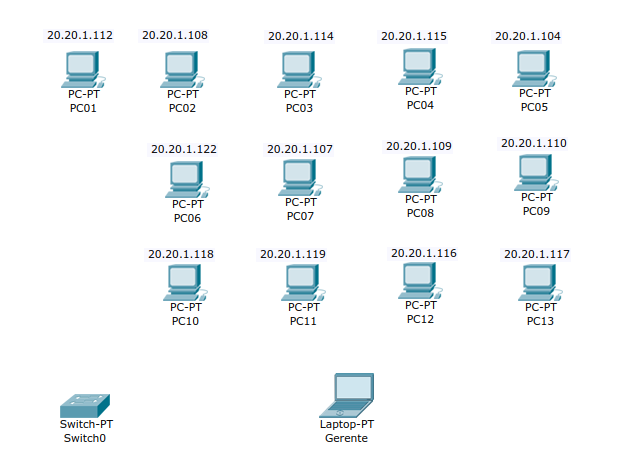
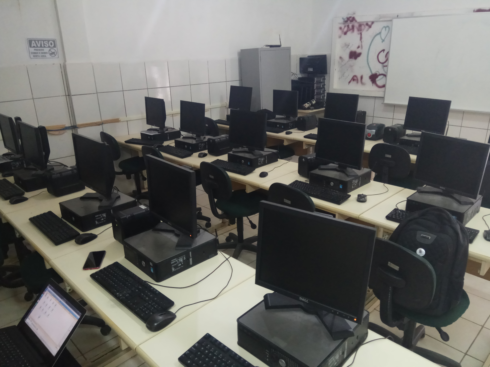
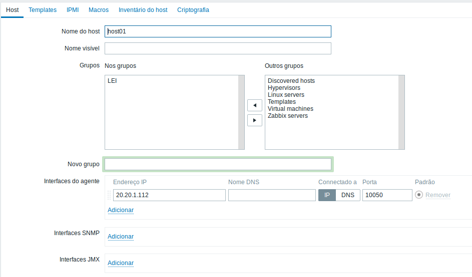
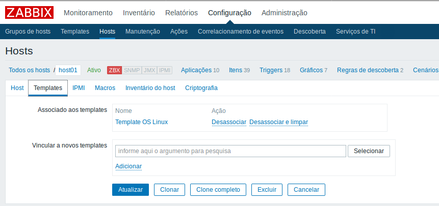
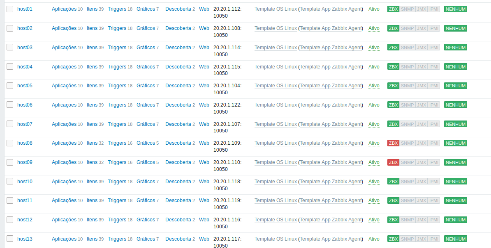
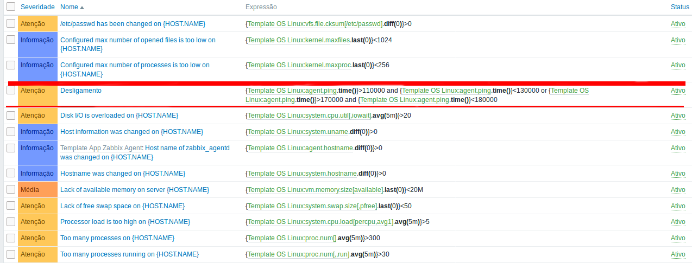
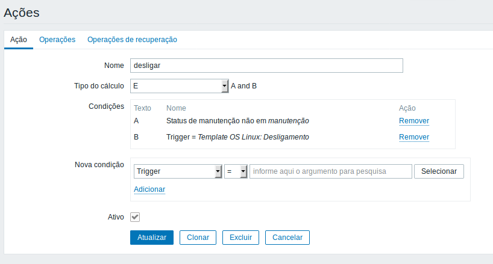
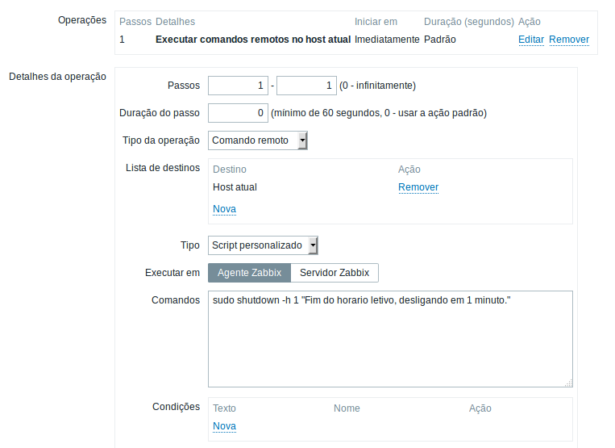

# Gerencia de Redes de Computadores
## Universidade Federal do Ceará - Campus Quixadá

## Monitorização do laboratório de informática da Escola de Ensino Médio Professora Maria Edilce Dias Fernandes - Ibicuitinga


Antonio Matheus Cavalcante da Silva <br>
Esdras Emanuel Mariano Moreira

## Objetivo
Fazer o Gerênciamento de um laboratório de informatica usando a ferramente de monitoramento ZABBIX. Esse trabalho monitorou 13 hosts do Laboratorio Escolar de Informatica da Escola Maria Edilce Dias Fernandes, na cidade de ibibutinga-ce. Foi implementado um script de desligamento automático das máquinas no fim do horario letivo para facilitar o trabalho do gerente e poupar recursos.

## Cenário

#### Topologia:
13 computadores funcionando

<div align="center"></div>
<div align="center"></div>

#### Sistema:
Ubuntu 16:04 

#### Funcionamento do laboratorio: 
07 às 11 e de 13 as 17

## Ferramenta
```
ZABBIX - Versão 3.2.11
```
## Servidor


## Instalação dos Agents
**pre-requisitos**
- sshpass

Fizemos um script para a instalação automatizada do agent zabbix em todos os hosts do laboratório. Usamos conexão via ssh para entrar em cada maquina e executar os comando e adicionar as configurações no arquivo zabbiz_agentd.conf.
o script pinga em todos os ips de um determinada rede que é colocada com parametro no momento da execução, em seguida os hosts que foram pigados seram tentado o acesso via ssh para ser executados os comando de instalaçao e configuração. <br>
**Modo de executar:**
```
./install_agents.sh subrede. usuario senha
./install_agents.sh 20.20.1. aluno aluno
```

## Configuração do ambiente no Zabbix

Criamos um grupo chamado LEI (Laborario Escolar de Informatica) para adicionar os host no mesmo.
<div align="center"></div>

Em cada host, adicionamos o template ( Template OS Linux )
<div align="center"></div>

Todos os Hosts Adicionados 
<div align="center"></div>

## trigger

<div align="center"></div>

```
{Template OS Linux:agent.ping.time()}>110000 and {Template OS Linux:agent.ping.time()}<130000 or {Template OS Linux:agent.ping.time()}>170000 and {Template OS Linux:agent.ping.time()}<180000
```
## Acão

<div align="center"></div>

## Operações
<div align="center"></div>

```
sudo shutdown -h 1 "Fim do horário letivo, desligando em 1 minuto."
```
